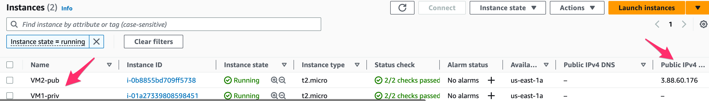
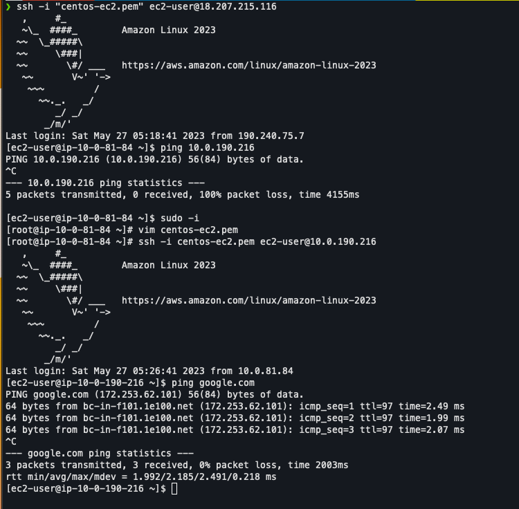

# 3. Cloud network:
---
## 1. Configure traffic control at the Instance and Subnet Levels.

* Create a Virtual Cloud Network that includes subnet, IP address, and tag.
* Create a Virtual Machine within a network.
* Configure firewall rules to control the traffic to your instance.
* Configure routes to enable traffic between subnets, including port-security

## 2.  Provision of a Cloud Virtual Network.

* The virtual Network name should be vnet-nebo  
* vnet-nebo address should be 10.0.0.0/16
* vnet-nebo should have two subnets: snet-public and snet-private
* snet-public address space should be 10.0.0.0/17 
* snet-private address space should be 10.0.128.0/17 
* VM1 deployed to subnet snet-private is not accessible from public hosts
* VM2 deployed to subnet snet-public is accessible from public hosts
* VM2 is able to connect to VM1

## Content
### compute module:
* **main.tf:** Terraform file dedicated to define compute resources in AWS for the exercise such as:  2 EC2, 2 security groups and their key pair.
* **variables.tf:** Terraform file to declare variables.
### networking module:
* **main.tf:** Terraform file dedicated to define network resources in AWS for the exercise such as: VPC, subnets, internet gateway, NAT gateway (In case VM1 needs access to internet to install some package) and routing tables with their association.
* **outputs.tf:** Terraform file dedicated to define the outputs of the module, this is important since the compute module will need to provision some of its resources based on resources of this module. *Example: EC2 (compute module) need a public subnet from networking module.*
### parent directory:
* **main.tf:** Terraform file dedicated to the 2 modules are called with their variables.
* **provider.tf:** Terraform file dedicated to the providers we are going to need, in our case only AWS.
* **backend.tf:** Terraform file dedicated to define where the backend of terraform will be, in this case in an S3 previously created.

```
cd networking
terraform init
cd ../compute
terraform init
cd ..
terraform init
terraform apply
```
After creating all the resources go to AWS console to check the IPs of the 2 EC2's.

* SSH into VM1 (shouldn't be possible), then SSH into VM2 and copy and save the private .pem key to SSH from there VM1.
* After SSH VM1, ping google.com in VM1 to check internet connectivity (that's why we used a NAT gateway).

