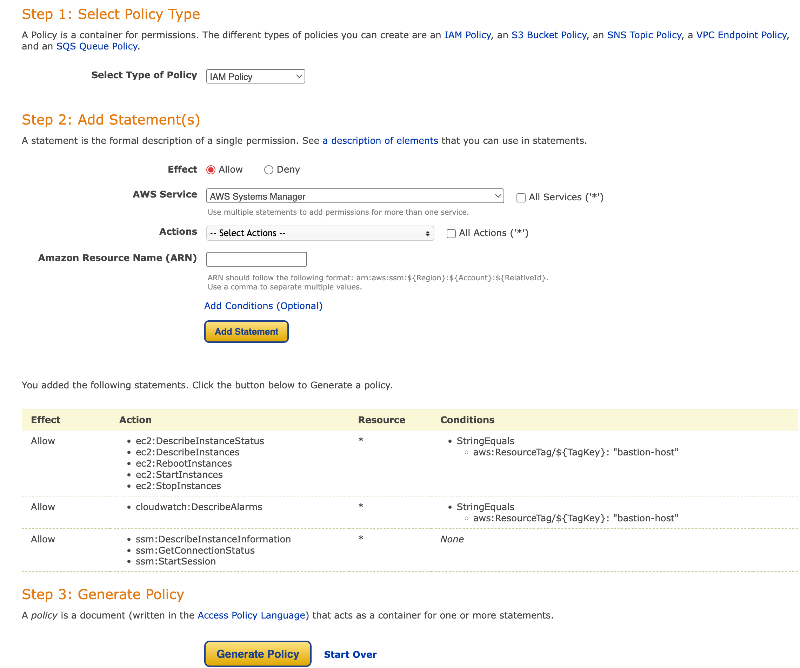
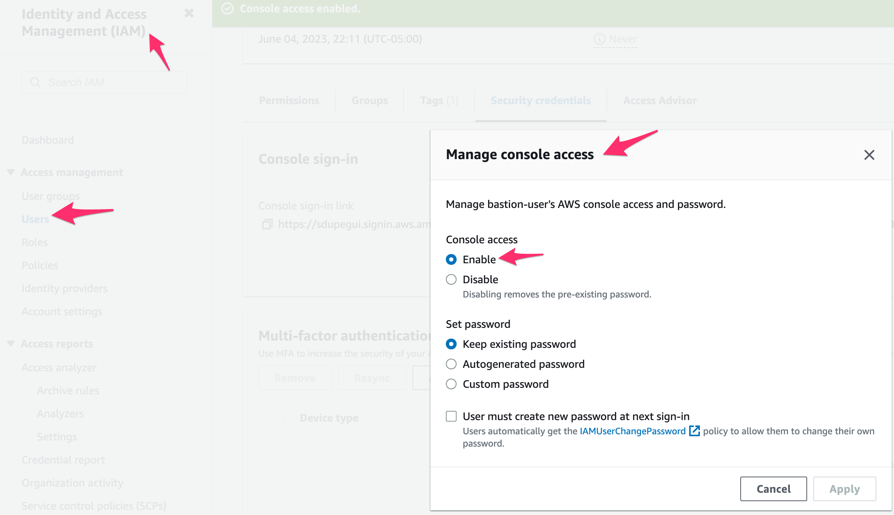
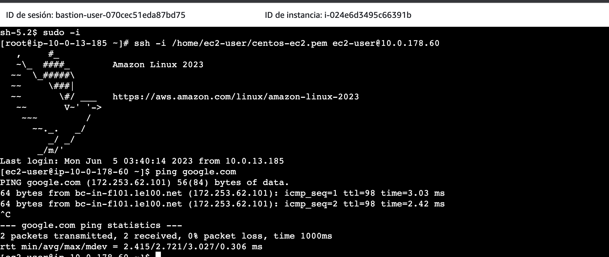

# 4. Cloud security:
---
## 1. Configuration and usage of secure shell access to systems and services.

### 1. Generate private and public keys using any available tools with an algorithm that is stronger than RSA 1024.
### 2. Create a new or use an existing account from any SCM provider.
### 3. Import to the new account the key that was generated on the previous activity.
### 4. Validate whether it is possible to interact with SCM from the local environment using the key.
For steps 1-4 check this runbook from github on how to setup ssh keys for repository [ssh-keys](https://docs.github.com/en/authentication/connecting-to-github-with-ssh/generating-a-new-ssh-key-and-adding-it-to-the-ssh-agent)

### 5. Create a new Linux instance.
* Setup SSM connection:
    * Create IAM role for SSM full access:
    
    * Attach role to ec2 instance.
    * Create security group to access ssh (inbound rules: TCP 443 and 22) or left the default one.
    
    
### 6. Create non-admin users for connecting to the hosts:
```
sudo useradd <new user>
```

login into the new user and put the public key (.pub):
```
su <new user>
mkdir ~/.ssh
mkdir ~/.ssh/authorized_keys
vim authorized_keys # Paste public key
chmod 700 ~/.ssh
chmod 600 ~/.ssh/authorized_keys 
```
Then, you should be able to connect the host via ssh with this user.
### 7. Disable root login to this instance.
```
sudo -i
vim /etc/ssh/sshd_config
```
Set the value of PermitRootLogin to **no**


### 8. Create a non-root user with sudo permission.
In this step you need to add a user to wheel group, in this case the user will be peex:
```
$ sudo usermod -aG wheel peex
$ cat /etc/group | grep wheel
wheel:x:4:ec2-user,peex
```
Another way is selecting group adm and edit sudoers file to let it have sudo permissions:
```
sudo visudo
```

### 9. Sign in to the instance as a non-root user via ssh.
```
ssh -i "key.pem" peex@<public_ip>
```                                   
### 10. Escalate permissions using sudo.
Now, thanks to step 8, this user has sudo permissions, to test it:
``` 
sudo -i
``` 
---
## 2. Secure network infrastructure.
This task will be solved using IaC tool Terraform to provision AWS resources.
### 1. Use session manager where possible.
Bastion EC2 will have role for SSM will be attached. Also, security group inbound rules will be defined for port TCP 443 and 22.
### 2. Configure Bastion Host or a similar cloud appliance.
Bastion EC2 will be on public subnet in VPC and it can reach hosts on private subnets of that VPC. 
### 3. Manage and control network traffic by firewall rules: Firewall rules are configured and prohibit access to the virtual server from anyone except the Bastion host
* For Bastion EC2 inbound rules for the security group will allow port TCP 22 and 443 only for IAM bastion-user's IP.
* For private EC2 inbound rules for the security group will allow TCP 22 for CIDR block of Bastion subnet.
### 4. Configure access management tools (for example, user, roles, profiles): Access to the Bastion server is configured only for user nebo with limited access to the cloud resources, except for access to the virtual servers.
* IAM user will be created for bastion-user, it will have a policy attached to only access EC2 service.
* To help you to create policy for IAM user you can use [AWS policy generator](https://awspolicygen.s3.amazonaws.com/policygen.html)

* Once the user has been created, go to AWS console > IAM > Users > enable console login:


## Content
### compute module:
* **main.tf:** Terraform file dedicated to define compute resources in AWS for the exercise such as:  2 EC2, 2 security groups and their key pair, the IAM user, roles and policies.
* **variables.tf:** Terraform file to declare variables.
### networking module:
* **main.tf:** Terraform file dedicated to define network resources in AWS for the exercise such as: VPC, subnets, internet gateway, NAT gateway (In case private EC2 needs access to internet to install some package) and routing tables with their association.
* **outputs.tf:** Terraform file dedicated to define the outputs of the module, this is important since the compute module will need to provision some of its resources based on resources of this module. *Example: EC2 (compute module) need a public subnet from networking module.*
### parent directory:
* **main.tf:** Terraform file dedicated to the 2 modules are called with their variables.
* **provider.tf:** Terraform file dedicated to the providers we are going to need, in our case only AWS.
* **backend.tf:** Terraform file dedicated to define where the backend of terraform will be, in this case in an S3 previously created.


```
cd networking
terraform init
cd ../compute
terraform init
cd ..
terraform init
terraform apply
```
After creating all the resources go to AWS console, login as bastion-user and check:
* Having connection to bastion instance via SSM, if so, paste the private key (.pem) inside ec2-user home directory. if not, check the policies attached to IAM role (EC2) and for the IAM user.

```
#Inside bastion via SSM:
sudo -i
cd /home
vim centos-ec2.pem
chmod 700 centos-ec2.pem
```
* Confirm that you can SSH into the private ec2 with the bastion. If not, check security group inbound rules for private ec2.
```
ssh -i centos-ec2.pem ec2-user@<private-ip-private-ec2>
```



