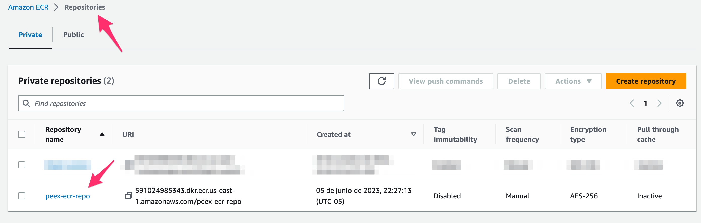
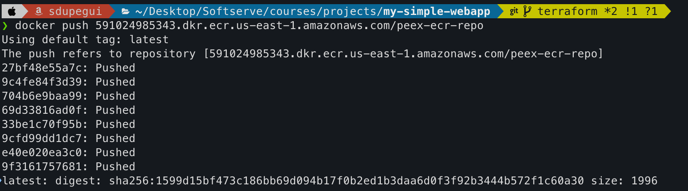
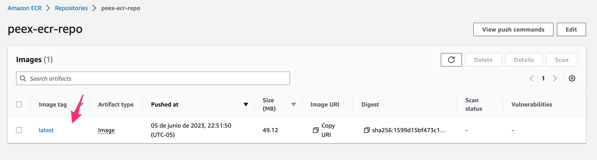

# 5. Cloud container
---
## 1. Create a parent container image.
It is required to build a parent image, which is a base layer of your image that refers to the contents of the FROM directive in the Dockerfile.

### 1. Use available App content, ensure the application is available in a container and through a web browser.
For our case, we will use the simple-web-app image created in this [repo](https://github.com/dupegui334/my-simple-webapp/blob/main/Dockerfile), which is available in [docker hub](https://hub.docker.com/layers/sdupegui/planet-app/1.3/images/sha256-1599d15bf473c186bb69d094b17f0b2ed1b3daa6d0f3f92b3444b572f1c60a30?context=repo) to push the image to AWS ECR.
Execute in local:
```
docker run -d -p 5000:5000 sdupegui/planet-app:1.3
```
Then go to web browser and connect to localhost:5000


Now that we have ensured that our image and container works, follow the next steps to AWS ECR.
### 2. Created and pushed container images into the Container Registry. The container from that image started successfully with port forwarding
* With terraform we will create ECR repository where the Docker image will be stored.
* Run terraform commands in the path of main.tf
```
terraform init
terraform plan
```
* Go to AWS console and look for ECR new private repository


**Ensure that you have AWS CLI and credential keys in local setted before following steps.**
* Generate AWS auth token for ECR ando login:
```
aws ecr get-login-password --region <region-used>
aws ecr --region <region-used> | docker login -u AWS -p <extense-token-from-previous-command> <repository-URI-AWS>
```

* Now that we are connected, tag the image and push to ECR:
```
docker tag sdupegui/planet-app:1.3 <repository-URI-AWS>
docker push <repository-URI-AWS>
```


* Go back to ECR repository in AWS console and confirm you have the image:

