# 6. Cloud storage: Provision of storage services.
---
## AWS S3:
* Created S3 Bucket
* Enabled Blocking Public Access to S3 bucket 
* Applied security measures:
    * Enabled Encryption on previously created bucket
    * Created Two Custom IAM Roles and assigned them to Two Users (you have to create them)
    * Role1 : Allowing only for Read-Only access to Previously Created S3 Bucket
    * Role2 : Allowing For Read-Write access to previously Created S3
        * Using Role2 Upload Dummy file (can be any file) to verify that you are capable of uploading the files
        * Using Role1 - Verify that you are able to download the file available on S3 but you are unable to upload your own file
    * Enabled Object Locking on S3 Bucket
    * Enabled Object Versioning Enabled on S3
    * Configured Object Deletion protection on S3 Bucket using MFA Delete
Configured S3 Replication across the region
Created S3 Gateway Endpoint. 

## Content
### compute module:
* **main.tf:** Terraform file dedicated to define compute resources in AWS for the exercise such as:  2 EC2, 2 security groups and their key pair, the 2 IAM user, roles, policies and the s3 bucket.
* **variables.tf:** Terraform file to declare variables.
### networking module:
* **main.tf:** Terraform file dedicated to define network resources in AWS for the exercise such as: VPC, subnets, internet gateway, NAT gateway (In case private EC2 needs access to internet to install some package) and routing tables with their association.
* **outputs.tf:** Terraform file dedicated to define the outputs of the module, this is important since the compute module will need to provision some of its resources based on resources of this module. *Example: EC2 (compute module) need a public subnet from networking module.*
### parent directory:
* **main.tf:** Terraform file dedicated to the 2 modules are called with their variables.
* **provider.tf:** Terraform file dedicated to the providers we are going to need, in our case only AWS.
* **backend.tf:** Terraform file dedicated to define where the backend of terraform will be, in this case in an S3 previously created.

To create resources, run:
```
cd networking
terraform init
cd ../compute
terraform init
cd ..
terraform init
terraform apply
```
* After creating all the resources go to AWS console, login as user1 or user2 and check the S3 bucket:
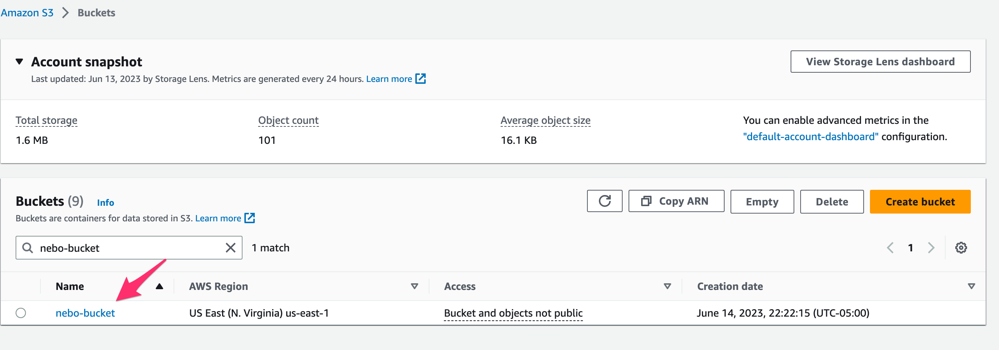
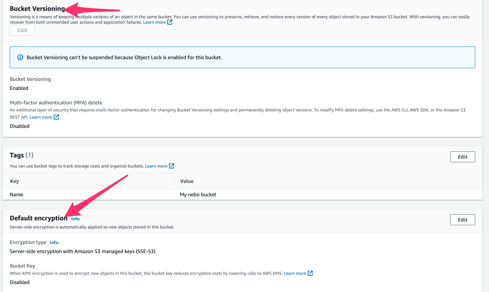
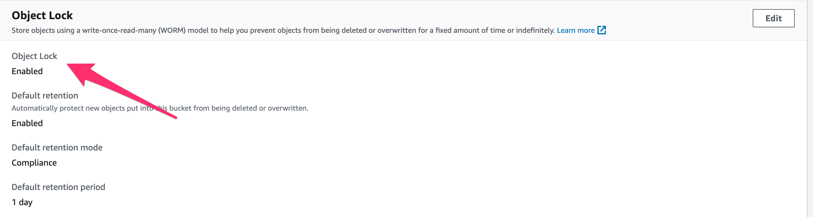

* Login as user 1 and try to upload a file:
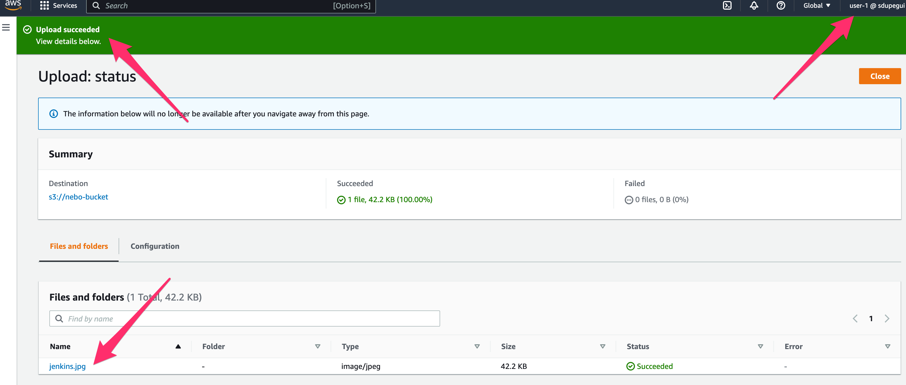
* Now login as user 2 and try to delete that same file: You shouldn't have permissions.
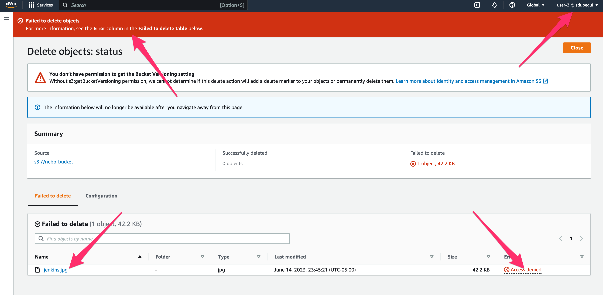

* Note: When trying to create replication accross region you'll get this error: 
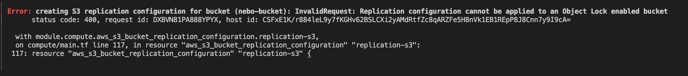
this is caused for enabling object lock to the bucket, the retention period is 1 day, so you can wait for tomorrow and deactivate that option in terraform (comment aws_s3_bucket_object_lock_configuration. nebo-s3-lock resource ) or create another bucket to continue the exercise. After that, apply the new infrastructure, go to S3 nebo-bucket > MANAGEMENT > replication rules and now you'll see the replication rule with the role:
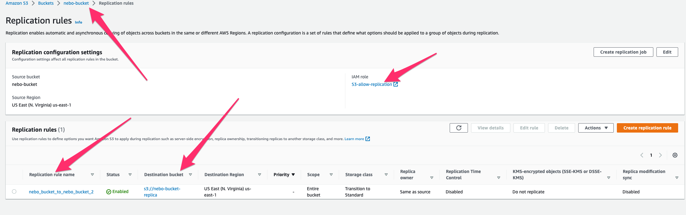
It means that if you upload a file in nebo-bucket, the same file will be replicated into nebo-bucket-replica automatically:
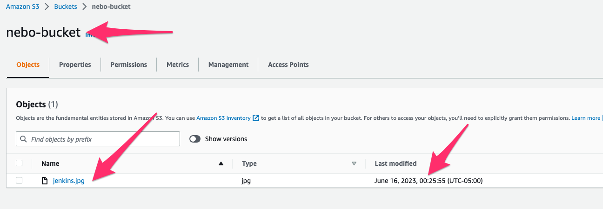
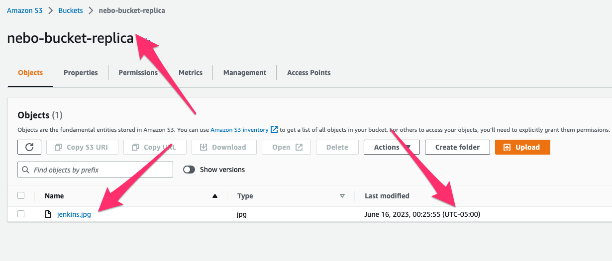
* Finally we'll add the VPC endpoint between EC2 on private subnet and S3 nebo bucket, but why? well, EC2 can reach the S3 service cause i doesn't have internet access. Why not using NAT gateway? it is expenssive and less secure than VPC enpoint (cost is free!).
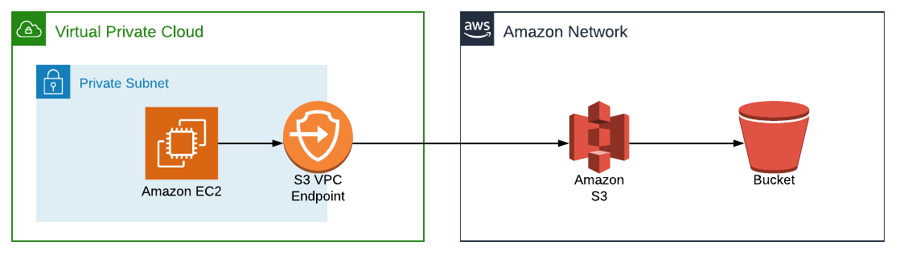  
If there is no VPC endpoint, after creating all resources again, SSH to bastion host and the hop to private instance, configure aws credentials and ping google.com or run "aws s3 ls" and see if you have internet access (shouldn't have cause there is no NAT GW):  
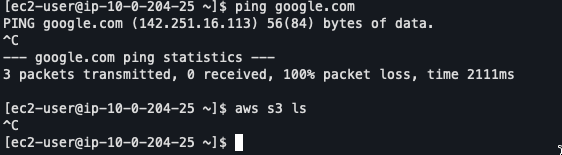  
Now if we add the VPC endpoint to the route table associated with the private subnet we can reach S3 and download their objects:  
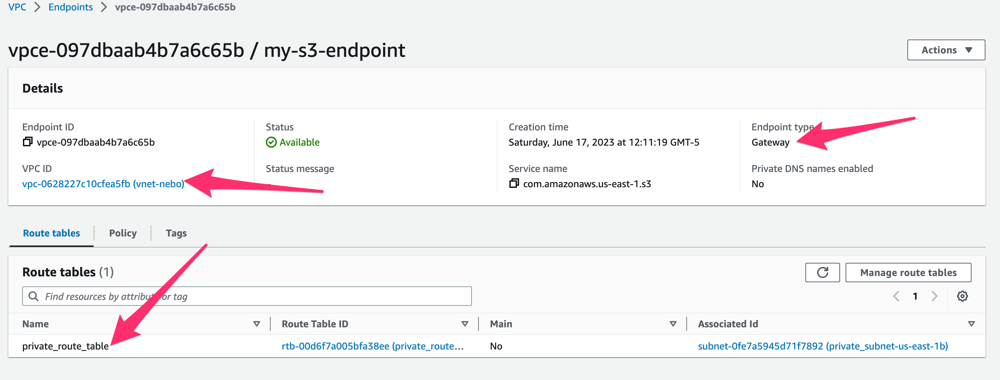
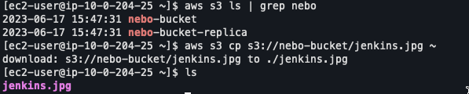  
**Before destroying all resources, both bucket needs to be emptied.**

---

## AWS EFS:

* Created EFS File System
* Implemented EFS Security:
* Enabled Data Encryption on created EFS Share
* Identity and Access implementation:
* Created IAM User, and delegated Minimum Access Rights to:
    * Create EFS Share
    * Mount EFS Share on EC2 instance
* Implemented EFS Resilience
* Configured EFS Share Replication
* Performed Failover 
* Deleted Replication

NOTE: when creating security groups for EC2, create inbound rule for port TCP 2049, that's the port used for EFS resource.
To create resources, run:

```
cd networking
terraform init
cd ../compute
terraform init
cd ..
terraform init
terraform apply
```
After that, go to AWS console with user-1 and look for EFS resource. There you should see the nebo EFS created:
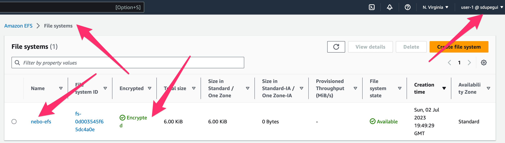

Go to AWS nebo EC2 instance and SSH to it, then create a directory inside /mnt, that is going to be the directory where we are going to attach the EFS.
```
cd /mnt
mkdir efs
cd efs
mkdir fs1
```
Then, install EFS library to mount the EFS:
```
sudo yum install -y amazon-efs-utils
```
Set up AWS credentials on EC2:
```
aws configure
```

Go back to EFS in AWS console, click on nebo EFS and select attach option, there select DNS and you'll see the commands that you need to execute to mount the EFS to the EC2 directory under "EFS mount helper":

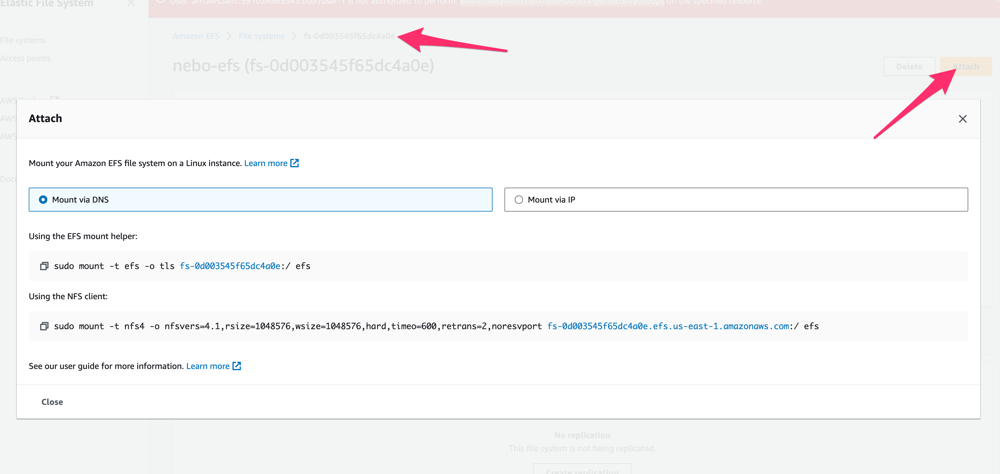
```
sudo mount -t efs -o tls fs-0d003545f65dc4a0e:/ /mnt/efs/fs1
```

To verify the mount run mount command and look for the EFS folder:

```
$ mount | grep efs/fs1
127.0.0.1:/ on /mnt/efs/fs2 type nfs4 (rw,relatime,vers=4.1,rsize=1048576,wsize=1048576,namlen=255,hard,noresvport,proto=tcp,port=20496,timeo=600,retrans=2,sec=sys,clientaddr=127.0.0.1,local_lock=none,addr=127.0.0.1)
```

To unmount run:
```
umount efs/fs1
```
