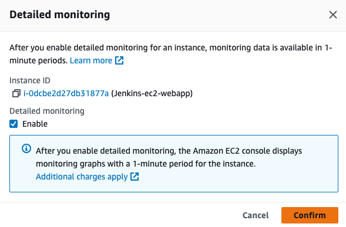
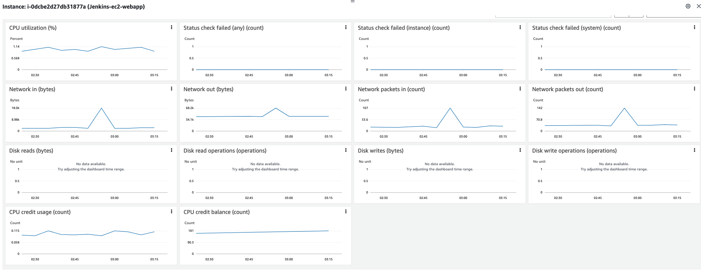
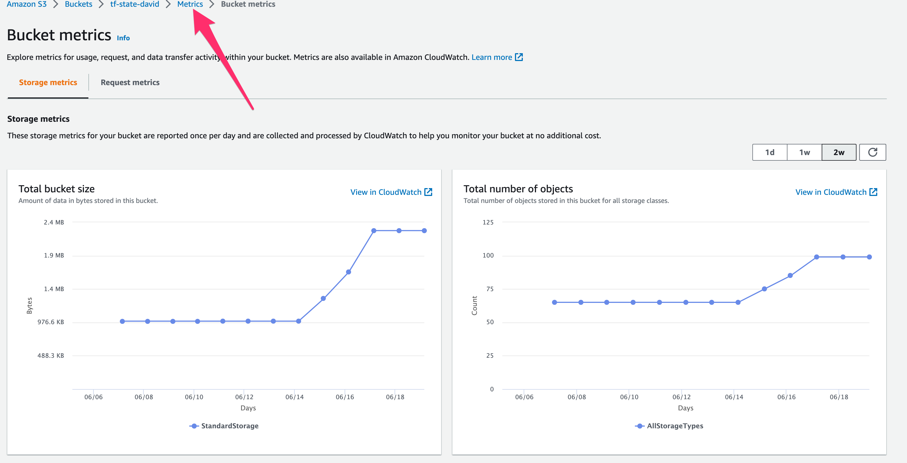
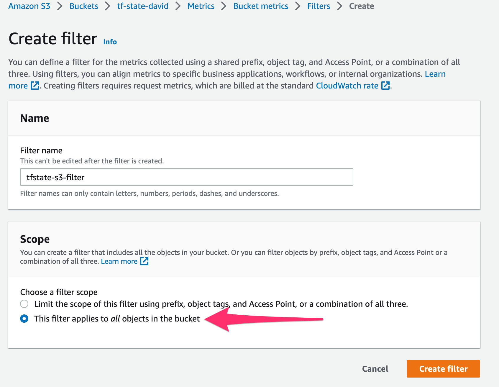
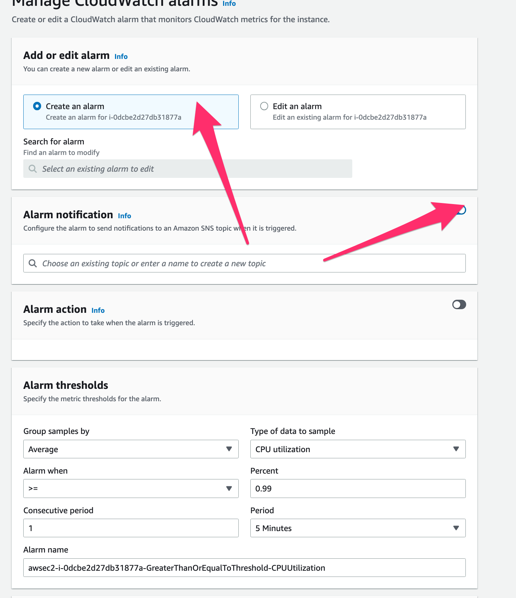

# 7. Observability and monitoring
---
## 1. CLOUD: Configure monitoring and logging of basic components
The goal is to assure monitoring of Amazon Web Services (AWS) resources, using AWS native solutions: AWS CloudTrail, AWS CloudWatch, Amazon EC2 Dashboard.

There are multiple services and utilities available from AWS that you can use to monitor your systems and access. Some of these tools are included in existing services, while others are available for additional costs.

Enable detailed CloudWatch monitoring:
- EC2 instance
- S3 bucket

All previously created EC2 instances with Terraform have the argument for monitoring, You just have to set it to true. Other way is by the console:
- EC2:  
    - We could enable Cloudwatch monitoring to our EC2 instances by activating this option:  
    
    

- S3:
    - In the case of S3 buckets, go to the bucket > Metrics > bucket metrics and there you'll see storage metrics.  
        
    - Go to Request metrics tab and create the filter:  
        
    
## Create Alerts for cloud monitoring and logging services 
Alerts are available in CloudWatch dashboard for EC2
S3 bucket event notifications set
S3 metrics are configured in CloudWatch and alarms are configured for these metrics

    - If you want to enable Cloudwatch alerts for EC2 go to the instance > actions > Monitor and troubleshoot > Manage Cloudwatch alarms:
    - Create alarm based on resource monitored.
    - Define notification using SNS subscription if wanted to send email or SMS.  
    